# ChatGPT App With ngrok: npx and a Company Profile

This tutorial uses `npx`, ngrok, ChatGPT Developer Mode, and a fictional company profile. By the end, ChatGPT can call AIProfile tools, ingest the synthetic `BrightLayer Systems` company profile, and answer a memory-backed product communication question.

ChatGPT apps connect from OpenAI infrastructure, not from your laptop. A local `localhost` URL is not reachable from ChatGPT, so this tutorial exposes AIProfile with a temporary HTTPS ngrok tunnel.

AIProfile exposes full MCP tools: `ingest`, `ask`, and `suggest_question`. Use ChatGPT Developer Mode for this tutorial. Deep research and data-only company knowledge flows expect a specialized `search` and `fetch` interface, which AIProfile does not expose.

For current OpenAI terminology and product behavior, see OpenAI's docs for [ChatGPT Developer Mode](https://developers.openai.com/api/docs/guides/developer-mode), [MCP and connectors](https://developers.openai.com/api/docs/guides/tools-connectors-mcp), and [apps in ChatGPT](https://help.openai.com/en/articles/11487775-connectors-in-chatgpt).

Use synthetic data while testing. The examples below use `BrightLayer Systems`, a fictional B2B infrastructure software company.

## Prerequisites

- Node.js 22 or later.
- An ngrok account and the `ngrok` CLI installed.
- ChatGPT access with Developer Mode available.
- Local terminal access to run AIProfile and keep the tunnel open.

## 1. Create a local AIProfile workspace

Create a dedicated directory for this company profile. AIProfile will create `config.yaml`, `models/`, and `memory/` in this directory.

```bash
mkdir aiprofile-chatgpt-company
cd aiprofile-chatgpt-company
```

Set up a small curated model through the published package:

```bash
npx --yes --ignore-scripts=false aiprofile setup-model --model qwen3-4b --write-config
```

The `--ignore-scripts=false` flag is intentional. AIProfile uses native dependencies and local model runtime packages that need install scripts.

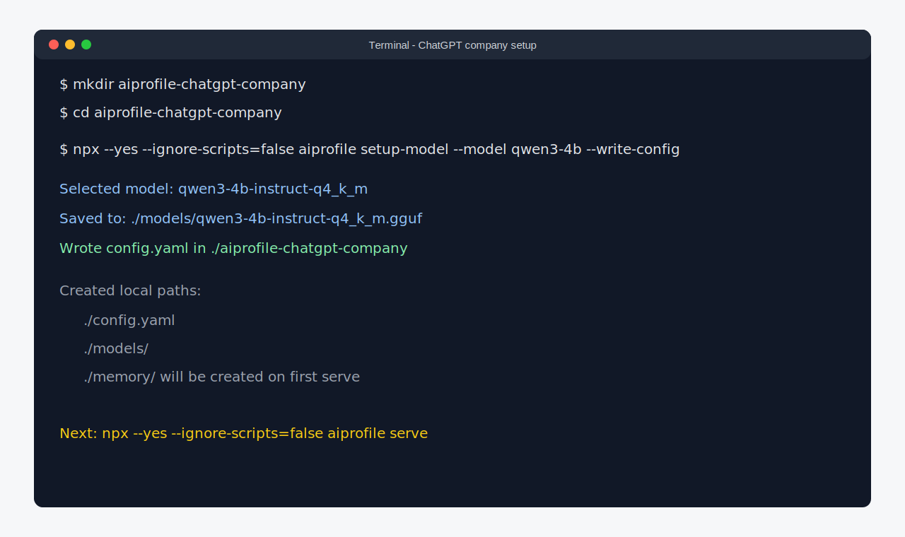

## 2. Start AIProfile with npx

Start the MCP server:

```bash
npx --yes --ignore-scripts=false aiprofile serve
```

On first startup, AIProfile asks you to create the encrypted memory vault password. Keep this terminal running.

The local MCP endpoint is:

```text
http://localhost:3000/mcp
```

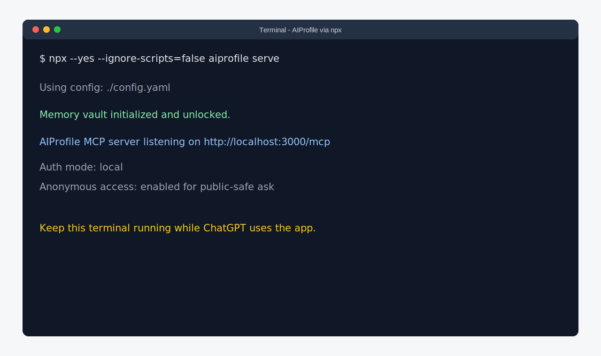

## 3. Start ngrok

Open a second terminal and expose port `3000`:

```bash
ngrok http 3000
```

Copy the public HTTPS origin from the forwarding line. In this tutorial, the example origin is:

```text
https://redacted-ngrok.ngrok-free.app
```

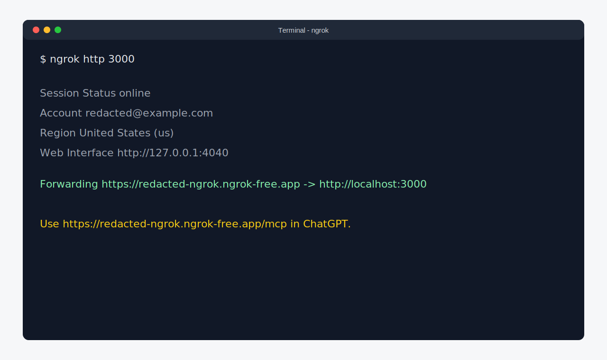

## 4. Configure AIProfile for ChatGPT

Stop AIProfile with `Ctrl+C`, update the generated `config.yaml`, and set both OAuth URLs to the ngrok URL:

```yaml
auth:
  mode: local
  anonymous_enabled: true
  issuer: https://redacted-ngrok.ngrok-free.app
  resource: https://redacted-ngrok.ngrok-free.app/mcp
```

Restart AIProfile after saving the config:

```bash
npx --yes --ignore-scripts=false aiprofile serve
```

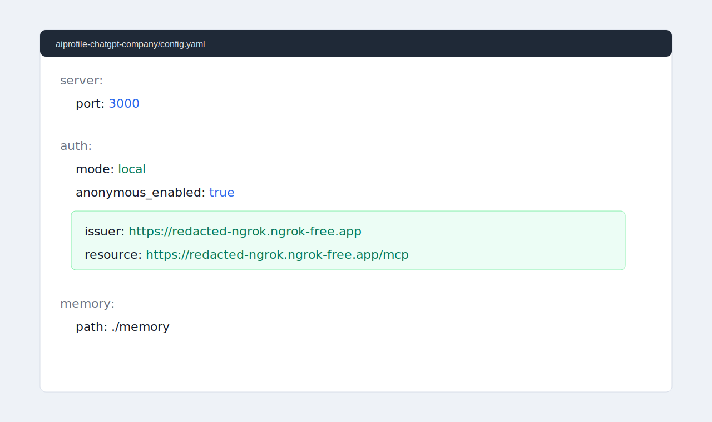

## 5. Create an owner grant

In a third terminal, create a grant bound to the public MCP resource:

```bash
npx --yes --ignore-scripts=false aiprofile auth grant add \
  --subject chatgpt-company-owner \
  --preset owner-full \
  --resource https://redacted-ngrok.ngrok-free.app/mcp
```

The command prints a one-time approval code. Keep it private. You will paste it into the AIProfile authorization page when ChatGPT starts OAuth.

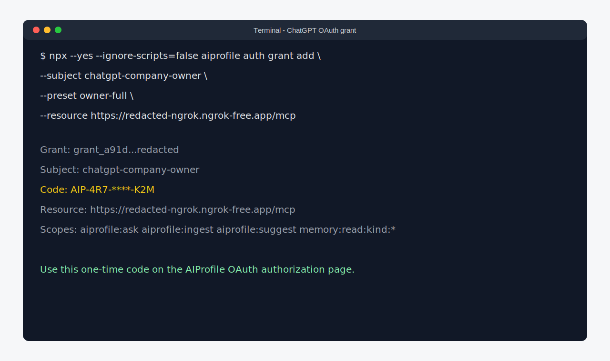

## 6. Enable Developer Mode in ChatGPT

In ChatGPT, open `Settings`, then `Apps`, then `Advanced settings`, and enable `Developer mode`.

Developer Mode is the right path for this tutorial because it can connect to a remote MCP server and expose AIProfile's action tools. A regular data-only or deep-research company knowledge app may complain that the server does not expose `search` and `fetch`.

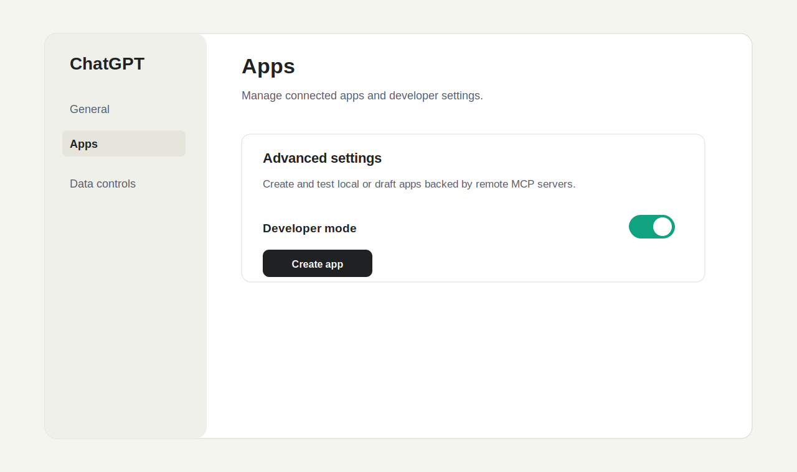

## 7. Create the ChatGPT app

In the Developer Mode area, choose `Create app` and use the public MCP URL:

```text
https://redacted-ngrok.ngrok-free.app/mcp
```

Use OAuth dynamic client registration. Leave static client ID and client secret fields empty unless you intentionally configured a static OAuth client in your own deployment.

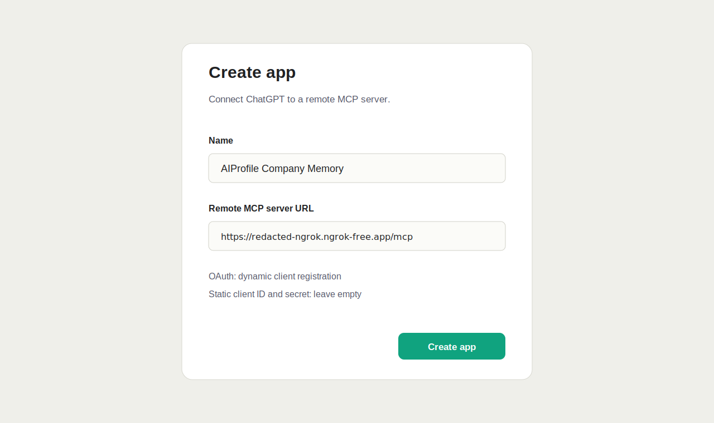

## 8. Authorize ChatGPT

When ChatGPT connects, AIProfile opens its OAuth authorization page. Paste the one-time approval code from the grant command, review the scopes, and approve.

For this tutorial, `owner-full` grants:

- `ask` access.
- `ingest` access.
- `suggest_question` access.
- owner-level memory read access.

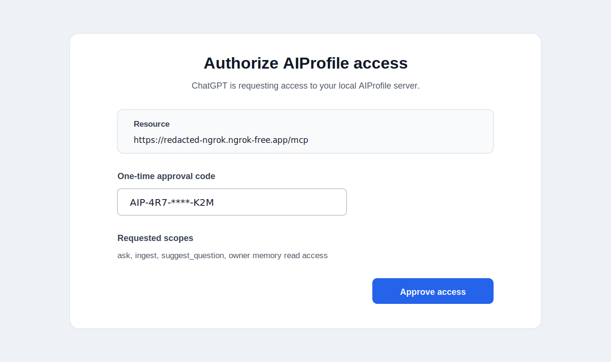

## 9. Enable the draft app in a ChatGPT conversation

Start a new ChatGPT conversation and enable the draft AIProfile app from the composer Developer Mode tool. ChatGPT should show AIProfile tools such as `ingest`, `ask`, and `suggest_question`.

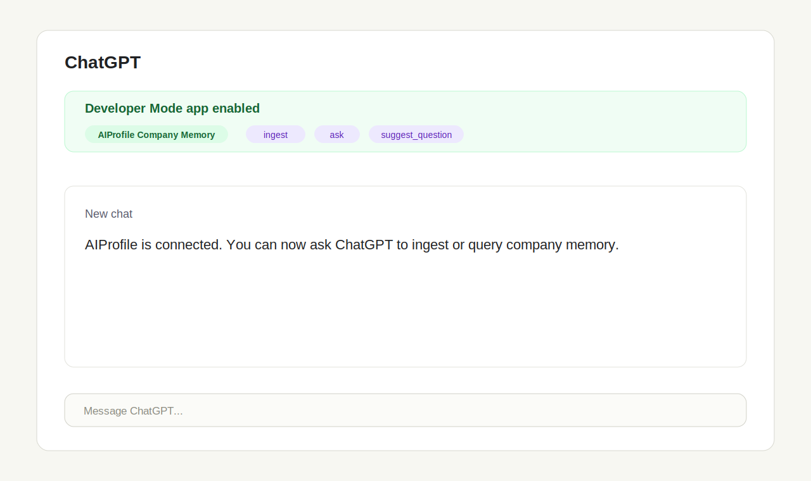

## 10. Ingest the BrightLayer Systems profile

Ask ChatGPT to call the AIProfile `ingest` tool with this content:

```text
Please ingest this synthetic company profile into AIProfile.

BrightLayer Systems is a fictional B2B infrastructure software company that helps mid-market operations teams monitor workflow health across internal tools. The company sells to operations leaders, platform teams, and support organizations that need reliable alerts before customer-impacting process failures happen.

BrightLayer's product principles:
- Show operational risk in plain language before exposing raw telemetry.
- Prioritize explainable alerts over opaque scoring.
- Make integrations easy to audit, pause, and roll back.
- Treat customer trust and data minimization as product features.

BrightLayer's customer profile:
- Mid-market SaaS, logistics, and fintech companies with complex internal workflows.
- Teams that have outgrown spreadsheets but do not want a heavy enterprise observability suite.
- Buyers care about fast setup, low false positives, and clear evidence trails.

BrightLayer's communication style is direct, practical, and customer-outcome focused. Customer-facing updates should start with the operational problem, explain what changed, name any limits or risks, and end with the concrete next action. The company avoids hype, vague AI language, and unverifiable claims.

BrightLayer's durable opinions:
- Workflow observability is only useful when non-engineers can act on it.
- AI features should summarize evidence and recommended actions, not hide uncertainty.
- Product launches should make rollout controls visible.
- Trust is easier to keep than rebuild after an unclear automation failure.
```

ChatGPT should request permission to call `ingest`. Approve the tool call. A successful result reports added or updated memory items.

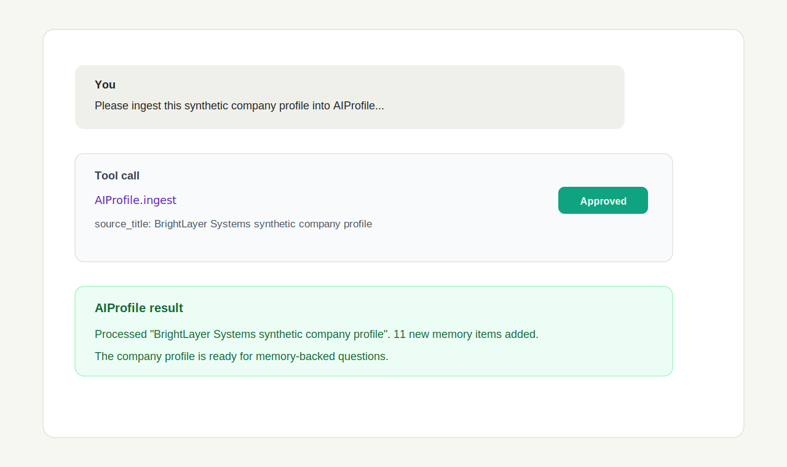

## 11. Ask a memory-backed question

Now ask ChatGPT:

```text
What should ChatGPT know before drafting a customer-facing product update for BrightLayer Systems?
```

ChatGPT should use AIProfile memory and answer with details from the ingested company profile, such as leading with the customer problem, avoiding hype, naming rollout limits, and grounding claims in evidence.

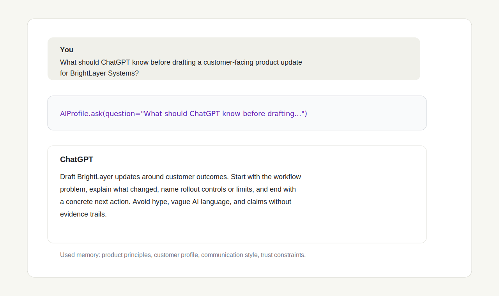

## Troubleshooting

### ChatGPT cannot reach the app

Confirm you used the public HTTPS ngrok URL, not `localhost`. ChatGPT connects from OpenAI infrastructure, so local-only URLs do not work.

Confirm all three places use the same public URL:

- The ngrok forwarding URL.
- `auth.issuer` in `config.yaml`.
- `auth.resource` and the ChatGPT app URL, including `/mcp`.

If the ngrok URL changes, update `config.yaml`, restart AIProfile, and create a new grant for the new `resource` URL.

### Developer Mode is missing

Confirm your ChatGPT plan and workspace allow Developer Mode. If you are in a managed workspace, an admin may need to allow custom apps.

### ChatGPT asks for `search` and `fetch`

You are likely using a data-only or deep-research company knowledge flow. AIProfile exposes `ingest`, `ask`, and `suggest_question`, so use Developer Mode for full MCP tool access.

### OAuth starts but the approval code fails

Approval codes are one-time credentials. Create a fresh grant and use the new code.

```bash
npx --yes --ignore-scripts=false aiprofile auth grant add \
  --subject chatgpt-company-owner \
  --preset owner-full \
  --resource https://redacted-ngrok.ngrok-free.app/mcp
```

### ChatGPT reports insufficient scope

Revoke the old grant and create a new grant with the scopes you need. For this tutorial, use `owner-full` because it includes `ask`, `ingest`, `suggest_question`, and owner memory access.

```bash
npx --yes --ignore-scripts=false aiprofile auth grant list
npx --yes --ignore-scripts=false aiprofile auth grant revoke <grant-id>
```

### AIProfile says there is not enough memory

The `ask` tool needs stored memory before it can answer reliably. Run the ingest step first, then ask again.

### The server was not restarted after editing `config.yaml`

AIProfile reads config at startup. Stop and restart the server after changing `auth.issuer` or `auth.resource`.

### Public tunnel safety

Keep ngrok open only while testing. Do not expose `auth.mode: off` through a public tunnel. Revoke grants when the tutorial is done:

```bash
npx --yes --ignore-scripts=false aiprofile auth grant list
npx --yes --ignore-scripts=false aiprofile auth grant revoke <grant-id>
```
