# Claude Custom Connector With ngrok

This tutorial connects Claude's web-hosted custom connector flow to a local AIProfile server through ngrok. By the end, Claude can call AIProfile tools, ingest a synthetic persona, and answer a question using stored memory.

Claude remote connectors connect from Anthropic's cloud infrastructure, not from your laptop. That means `localhost` is not reachable from Claude. For a local AIProfile server, expose the MCP endpoint with a temporary HTTPS tunnel such as ngrok.

Use synthetic data while testing. The examples below use `Alex Rivera`, a fictional product and engineering leader.

## Prerequisites

- Node.js 22 or later.
- A cloned AIProfile repository.
- An ngrok account and the `ngrok` CLI installed.
- A Claude plan and workspace where custom connectors are available.
- Local terminal access to run AIProfile and keep the tunnel open.

## 1. Install AIProfile and set up a model

From the repository root, install dependencies, download a small curated model, write the model config, and build the project:

```bash
npm install --ignore-scripts=false
npm run setup-model -- --model qwen3-4b --write-config
npm run build
```

If you prefer running from the published package instead of source, see [NPX Usage](/guide/npx).

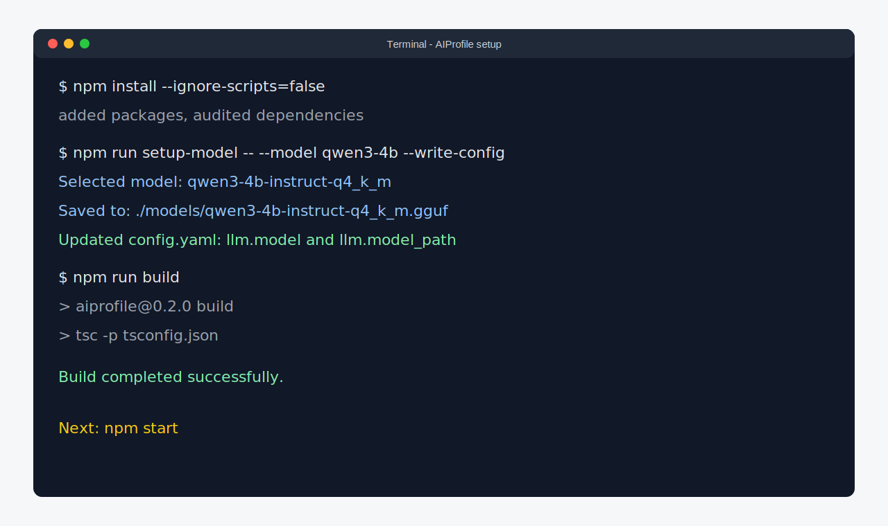

## 2. Start AIProfile locally

Start the MCP server:

```bash
npm start
```

On first startup, AIProfile asks you to create the encrypted memory vault password. Keep this terminal running.

The local MCP endpoint is:

```text
http://localhost:3000/mcp
```

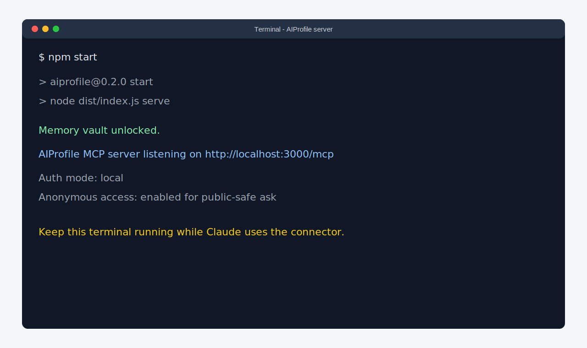

## 3. Start ngrok

Open a second terminal and expose port `3000`:

```bash
ngrok http 3000
```

Copy the public HTTPS origin from the forwarding line. In this tutorial, the example origin is:

```text
https://redacted-ngrok.ngrok-free.app
```

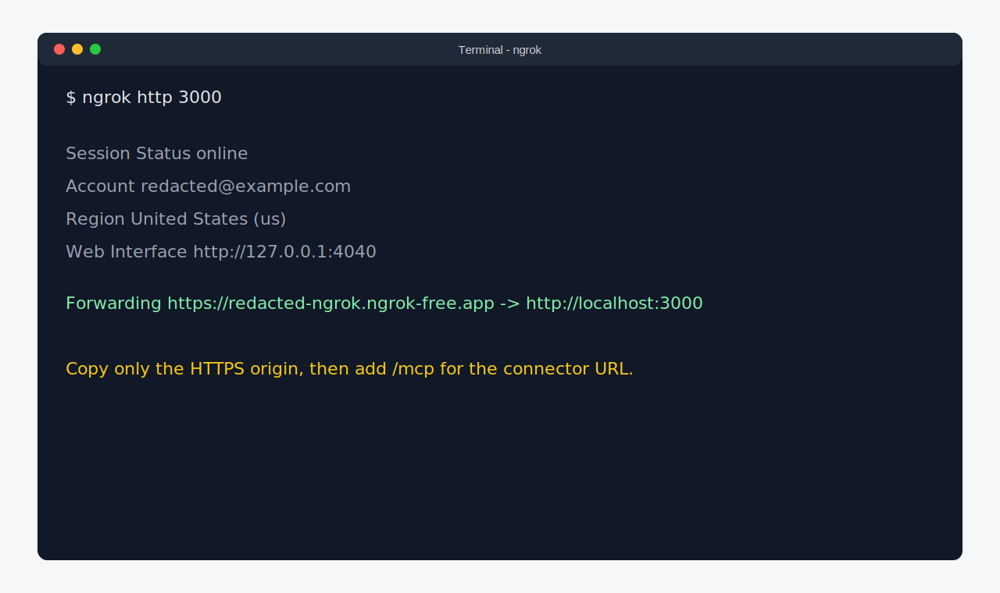

## 4. Configure AIProfile for the public MCP URL

Stop AIProfile with `Ctrl+C`, update `config.yaml`, and set both OAuth URLs to the ngrok URL:

```yaml
auth:
  mode: local
  anonymous_enabled: true
  issuer: https://redacted-ngrok.ngrok-free.app
  resource: https://redacted-ngrok.ngrok-free.app/mcp
```

Restart AIProfile after saving the config:

```bash
npm start
```

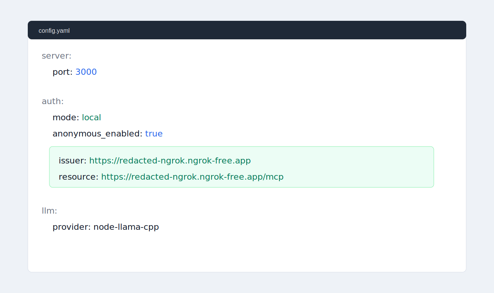

## 5. Create an owner grant

In a third terminal, create a grant bound to the public MCP resource:

```bash
npm run auth -- grant add \
  --subject claude-web-owner \
  --preset owner-full \
  --resource https://redacted-ngrok.ngrok-free.app/mcp
```

The command prints a one-time approval code. Keep it private. You will paste it into the AIProfile authorization page when Claude starts OAuth.

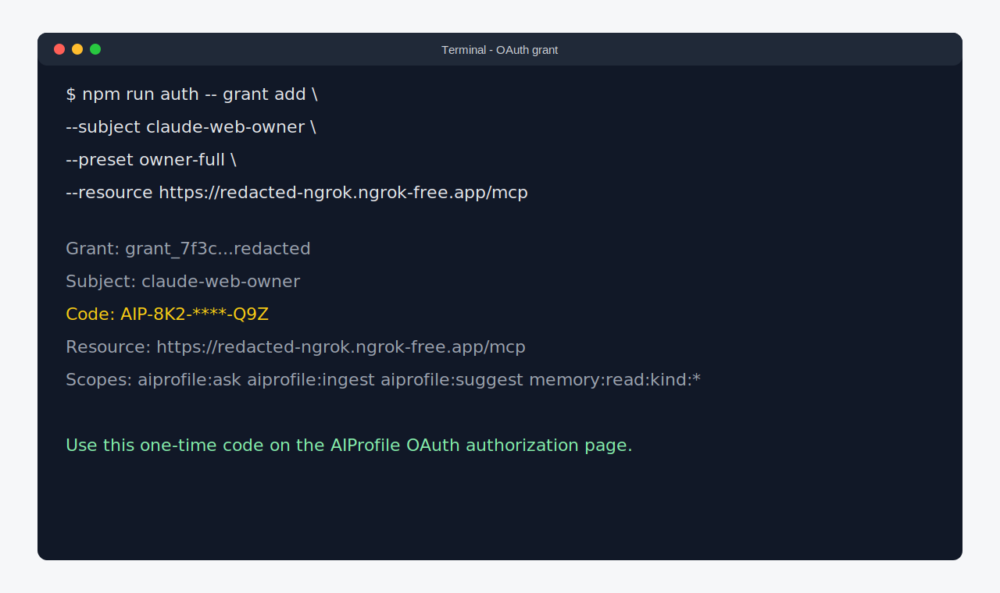

## 6. Add the custom connector in Claude

In Claude, open `Customize`, then `Connectors`, and choose the option to add a custom connector.

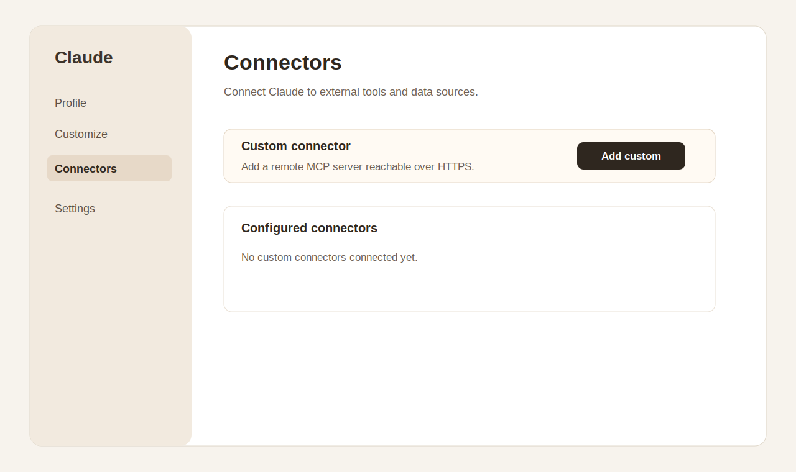

Use the public MCP URL:

```text
https://redacted-ngrok.ngrok-free.app/mcp
```

Leave advanced OAuth client settings empty unless you intentionally configured a static client in your own deployment. AIProfile supports dynamic client registration for this local flow.

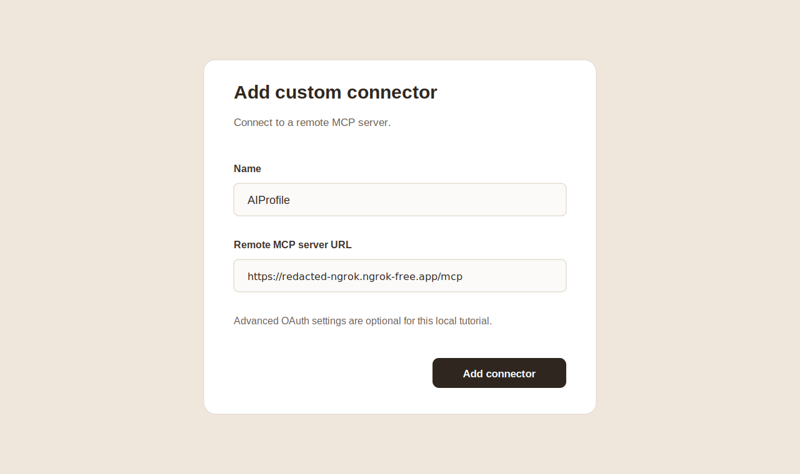

## 7. Authorize Claude

When Claude connects, AIProfile opens its OAuth authorization page. Paste the one-time approval code from the grant command, review the scopes, and approve.

For this tutorial, `owner-full` grants:

- `ask` access.
- `ingest` access.
- `suggest_question` access.
- owner-level memory read access.

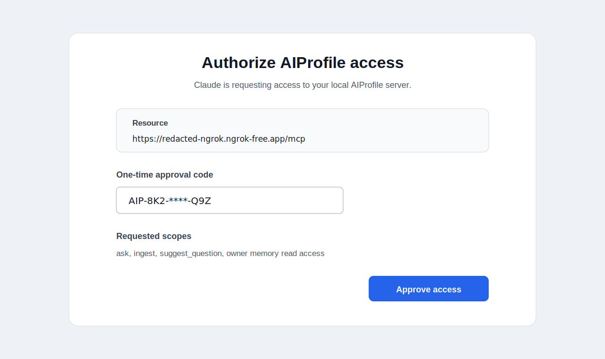

## 8. Enable the connector in a Claude conversation

Start a new Claude conversation and enable the AIProfile connector from the connectors or tools menu. Claude should show AIProfile tools such as `ingest`, `ask`, and `suggest_question`.

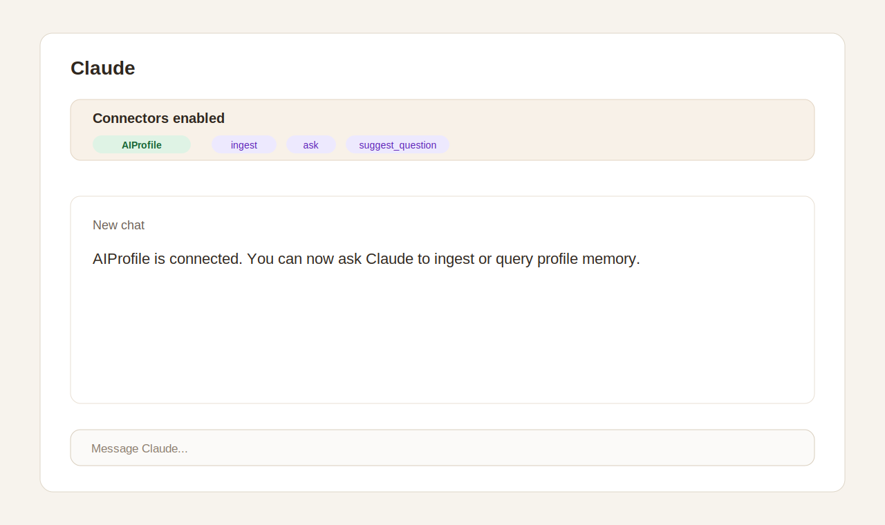

## 9. Ingest the Alex Rivera persona

Ask Claude to call the AIProfile `ingest` tool with this content:

```text
Please ingest this synthetic persona into AIProfile.

Alex Rivera is a product and engineering leader who works best with direct written context, crisp decision records, and small teams that can own outcomes end to end. Alex has led platform, developer tools, and B2B SaaS teams. Alex prefers project updates that start with the decision or risk, then give evidence and next steps. Alex dislikes status theater and prefers visible tradeoffs over vague optimism.

Alex's durable opinions:
- Good engineering strategy should connect technical sequencing to user-visible outcomes.
- Platform teams should publish clear contracts and measure adoption, not just ship internal abstractions.
- Roadmaps should make uncertainty explicit and separate commitments from bets.
- Healthy teams write down decisions before memories diverge.

Alex's communication style is calm, concrete, and concise. For executives, Alex uses business impact first. For engineers, Alex includes constraints, risks, and implementation details.
```

Claude should request permission to call `ingest`. Approve the tool call. A successful result reports added or updated memory items.

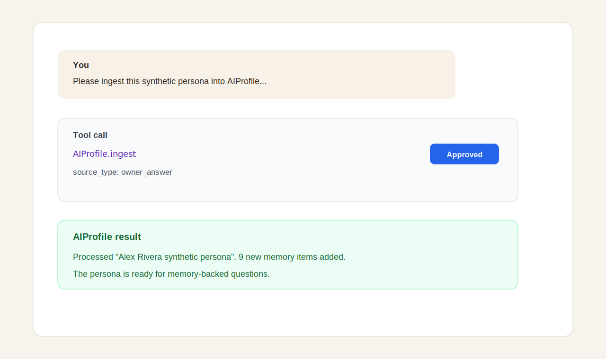

## 10. Ask a memory-backed question

Now ask Claude:

```text
What should Claude know before drafting a project update as Alex?
```

Claude should use AIProfile memory and answer with details from the ingested persona, such as leading with decisions or risks, grounding updates in evidence, and making tradeoffs explicit.

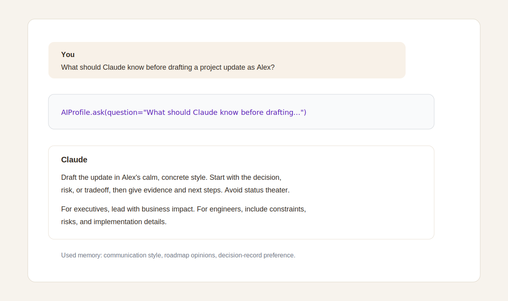

## Troubleshooting

### Claude cannot reach the connector

Confirm all three places use the same public URL:

- The ngrok forwarding URL.
- `auth.issuer` in `config.yaml`.
- `auth.resource` and the connector URL, including `/mcp`.

If the ngrok URL changes, update `config.yaml`, restart AIProfile, and create a new grant for the new `resource` URL.

### OAuth starts but the approval code fails

Approval codes are one-time credentials. Create a fresh grant and use the new code.

```bash
npm run auth -- grant add \
  --subject claude-web-owner \
  --preset owner-full \
  --resource https://redacted-ngrok.ngrok-free.app/mcp
```

### Claude reports insufficient scope

Revoke the old grant and create a new grant with the scopes you need. For this tutorial, use `owner-full` because it includes `ask`, `ingest`, `suggest_question`, and owner memory access.

```bash
npm run auth -- grant list
npm run auth -- grant revoke <grant-id>
```

### AIProfile says there is not enough memory

The `ask` tool needs stored memory before it can answer reliably. Run the ingest step first, then ask again.

### The server was not restarted after editing `config.yaml`

AIProfile reads config at startup. Stop and restart the server after changing `auth.issuer` or `auth.resource`.

### Public tunnel safety

Keep ngrok open only while testing. Do not expose `auth.mode: off` through a public tunnel. Revoke grants when the tutorial is done:

```bash
npm run auth -- grant list
npm run auth -- grant revoke <grant-id>
```
